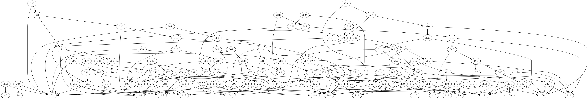

### Byte pair encoding algorithm

The algorithm compresses text by initially replacing the highest frequency pair of characters with a generated token. Through every iteration the token pair with the highest frequency gets replaced with another generated token. This goes on in a loop until the most frequent pair of tokens remain to occure onyl one time.

A look-up table of the replacements is required to rebuild the initial dataset.

#### Quick start

`git clone git@github.com:toxypiks/byte_pair_encoding.git`  
`cd byte_pair_encoding` 
`mkdir build` 
`cd build` 
`cmake ..` 
`make` 

#### Generating the dot graph

`./main > pair.dot` 
`dot -Tpng pair.dot -o pair.png` 

